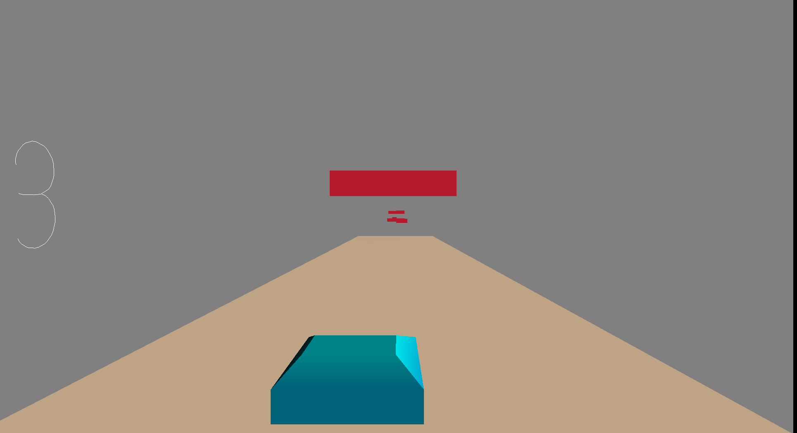

# Rick Braker 2: Tokyo Drift

Author: Joshua Mathews

Design: An endless driving game where the driver can flip gravity and drive upside down to avoid obstacles.

Screen Shot:

How To Play:

Press A and D to move left and right. Hold W to drive upside down. Dodge obstacles to get the highest points possible.

This game was built with [NEST](NEST.md).
